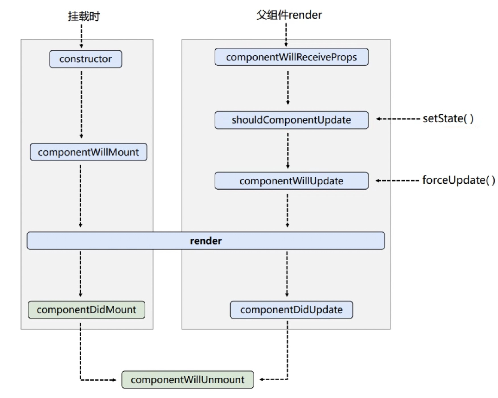
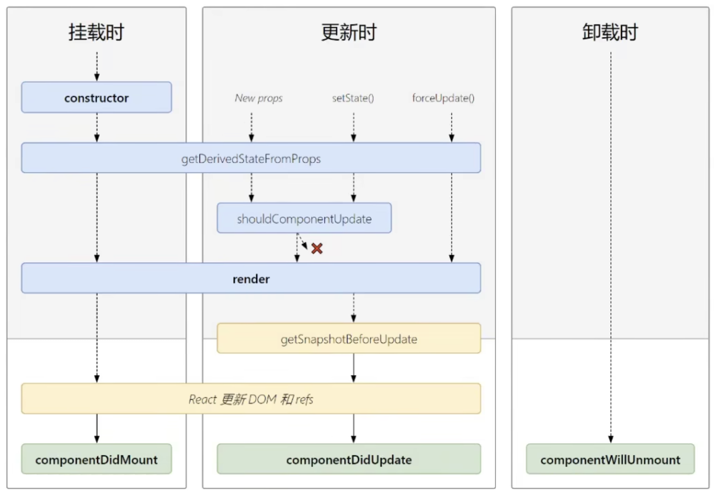

## 初识React

**中文文档** <https://zh-hans.react.dev/>

使用React的好处：

1. 采用**组件化模式**、**声明式编码**，提高开发效率及组件复用率
2. 在 React Native中可以使用React语法进行**移动端开发**
3. 使用**虚拟DOM**+**Diff算法**，尽量减少与真实DOM的交互


开始我们的第一个react页面：

```html
<!DOCTYPE html>
<html lang="en">

<head>
  <meta charset="UTF-8">
  <title>hello_react</title>
</head>

<body>
  <!-- 准备好一个“容器” -->
  <div id="test"></div>

  <!-- 引入react核心库 -->
  <script type="text/javascript" src="../js/react.development.js"></script>
  <!-- 引入react-dom，用于支持react操作DOM -->
  <script type="text/javascript" src="../js/react-dom.development.js"></script>
  <!-- 引入babel，用于将jsx转为js -->
  <script type="text/javascript" src="../js/babel.min.js"></script>

  <script type="text/babel"> /* 此处一定要写babel */
    //1.创建虚拟DOM
    const VDOM = <h1>Hello,React</h1> /* 此处一定不要写引号，因为不是字符串 */
    //2.渲染虚拟DOM到页面
    ReactDOM.render(VDOM,document.getElementById('test'))
  </script>
</body>

</html>
```

创建虚拟DOM的两种方式：

- JS方式(一般不用) `React.createElement( 标签类型，{标签内联属性}，标签内容 )`
- JSX方式, 即上述在 script 标签里写 HTML 的方式

那么到底什么是虚拟DOM呢？

1. 虚拟`DOM`本质是`Object`类型的对象（一般对象）
2. 虚拟`DOM`比较 “**轻**”，真实`DOM`比较 “**重**”，因为虚拟`DOM`是`React`内部在用，无需真实`DOM`上那么多的属性
3. 虚拟`DOM`最终会被`React`转化为真实`DOM`，呈现在页面上


## JSX语法

全称`JavaScript XML`，是React定义的一种类似于XML的JS扩展语法: JS + XML本质上就是`React.createElement()`方法的语法糖，目的是用来简化创建虚拟DOM。

具体用法如上，在 script 标签里写 HTML 的方式，注意它不是字符串, 也不是HTML/XML标签，而是通过一个变量进行接收的，它最终产生的就是一个JS对象。

语法规则： 

1. 定义虚拟DOM时，不要写引号。

2. 标签中混入**JS表达式时**要用 `{ }`。

3. 样式的类名指定不要用 class，要用 `className`。（因为class是ES6中类的关键字，所以不让用）

4. 内联样式，要用 `style={{ key:value }}` 的形式去写。

5. 只有一个根标签

6. 标签必须闭合

7.标签首字母

- 若**小写字母**开头，则将该标签转为`html`中同名元素，若`html`中无该标签对应的同名元素，则报错。
- 若**大写字母**开头，`React`就去渲染对应的组件，若组件没有定义，则报错


## 组件化编程

组件：就是用来实现局部功能效果的代码和资源的集合，方便复用到其他位置而进行封装的产物。

**函数式组件**

```jsx
// 1. 创建函数式组件
function MyComponent(){
  console.log(this); //此处的this是undefined，因为babel编译后开启了严格模式
  return <h2>我是用函数定义的组件（适用于简单组件的定义）</h2>
}
// 2. 渲染组件到页面
ReactDOM.render(<MyComponent/>, document.getElementById('test'))
```

执行了`ReactDOM.render(<MyComponent/>.......)`之后，发生了什么？

1. React解析组件标签，找到了MyComponent组件。
2. 发现组件是使用函数定义的，随后**调用该函数**，将返回的虚拟DOM转为真实DOM，随后呈现在页面中。


**类式组件**

```jsx
//1.创建类式组件
class MyComponent extends React.Component {
  render(){
	//render是放在哪里的？—— MyComponent的原型对象上，供实例使用。
	//render中的this是谁？—— MyComponent的实例对象 <=> MyComponent组件实例对象。
	console.log('render中的this:',this);
	return <h2>我是用类定义的组件(适用于【复杂组件】的定义)</h2>
  }
}
//2.渲染组件到页面
ReactDOM.render(<MyComponent/>,document.getElementById('test'))
```

执行了`ReactDOM.render(<MyComponent/>.......`之后，发生了什么？

1. React解析组件标签，找到了MyComponent组件。
2. 发现组件是使用类定义的，随后`new`出来该类的实例，并通过该实例调用到原型上的`render`方法。
3. 将`render`返回的虚拟DOM转为真实DOM，随后呈现在页面中。


## 组件实例核心属性

只有类式组件才能获取到组件实例，即this指向的实例对象，所以**核心属性是针对类式组件来说的**。

但是现在我们也可以使用 hooks 来获取到相关核心属性，即**函数式组件也支持了，并且会成为后续主流写法**

### state属性（类式）

组件的state属性是一个对象，里面放的是多个key-value，可以看成是组件的数据仓库。

修改组件的state属性需要使用setState进行更新，不可以直接修改。

```jsx
// 1.创建组件
class Weather extends React.Component {
	
  // 构造器调用几次？ ———— 1次
  constructor(props){
    super(props)
    // 初始化状态
    this.state = {isHot:false,wind:'微风'}
    // 解决 changeWeather 中 this 指向问题
    this.changeWeather = this.changeWeather.bind(this)
  }

  // render调用几次？ ———— 1+n次 1是初始化的那次 n是状态更新的次数
  render(){
    console.log('render');
    //读取状态
    const {isHot,wind} = this.state
    return <h1 onClick={this.changeWeather}>今天天气很{isHot ? '炎热' : '凉爽'}，{wind}</h1>
  }

  // changeWeather调用几次？ ———— 点几次调几次
  changeWeather(){
    // changeWeather放在哪里？ ———— Weather的原型对象上，供实例使用
    // 由于changeWeather是作为onClick的回调，所以不是通过实例调用的，是直接调用
    // 类中的方法默认开启了局部的严格模式，所以changeWeather中的this为undefined

    console.log('changeWeather');
    // 获取原来的isHot值
    const isHot = this.state.isHot
    // 严重注意：状态必须通过setState进行更新,且更新是一种合并，不是替换。
    this.setState({isHot:!isHot})
    // console.log(this);

    // 严重注意：状态(state)不可直接更改，下面这行就是直接更改！！！
    // this.state.isHot = !isHot //这是错误的写法
  }
}
//2.渲染组件到页面
ReactDOM.render(<Weather/>,document.getElementById('test'))
```

**注意：**如果在render()函数返回的模板中直接调用changeWeather()方法,其内部是获取不到 this.state 的。因为类中定义的方法，在内部默认开启了**局部**的严格模式 开启严格模式，函数如果直接调用，this不会指向实例，而是undefined。    
所以就需要在constructor() 构造器函数中通过 bind() 方法修改this指向，将其指向实例。这样的话render()函数返回的模板中绑定的this.changeWeather方法就是经过修改this指向后的方法，方法内部的this可以获取到state。

**简写形式**

原理：

1. 在类中直接写赋值语句，等于是给类的**实例对象**添加属性且赋值，相当于添加固定值属性；
2. 不用bind来绑定this（赋值语句的形式+箭头函数）

```jsx
// 1.创建组件
class Weather extends React.Component{
  // 初始化状态
  state = {isHot:false,wind:'微风'}

  render(){
    const {isHot,wind} = this.state
    return <h1 onClick={this.changeWeather}>今天天气很{isHot ? '炎热' : '凉爽'}，{wind}</h1>
  }

  // 自定义方法————要用赋值语句的形式 + 箭头函数
  // 没有放在原型上，而是放在实例上
  changeWeather = () => {
    const isHot = this.state.isHot
    this.setState({isHot:!isHot})
  }
}
// 2.渲染组件到页面
ReactDOM.render(<Weather/>,document.getElementById('test'))
```


***函数式组件的使用方法参考后面的Hooks章节的[useState](###useState)***

### props属性(类式)

**理解：**

1. 每个组件对象都会有`props`属性

2. 组件标签的所有属性都保存在`props`中

**作用：**

1. 通过标签属性从组件**外**向组件**内**传递变化的数据
2. 注意: 组件内部**不可修改**`props`数据，是只读的

还可以通过官方库 **prop-types** 限制props的类型，必要性等：

```jsx
<!-- 引入prop-types，用于对组件标签属性进行限制 -->
<script type="text/javascript" src="../js/prop-types.js"></script>

// 创建组件 
class Person extends React.Component{
  render() {
    return (
      <ul>
        <li>姓名：{this.props.name}</li> 
        <li>性别：{this.props.sex}</li> 
        <li>年龄：{this.props.age}</li>
      </ul>
    )
  },
  //对标签属性进行类型、必要性的限制
  static propTypes = {
    name:PropTypes.string.isRequired, // 限制name必传，且为字符串
    sex:PropTypes.string, // 限制sex为字符串
    age:PropTypes.number, // 限制age为数值
    speak:PropTypes.func, // 限制speak为函数
  },
  //指定默认标签属性值
  static defaultProps = {
    sex:'男', // sex默认值为男
    age:18 //age默认值为18
  }
}
// 渲染组件到页面上
ReactDOM.render(<Person name="andy" age="18" sex="男"/>, document.getElementById('test'))
// 批量传递标签属性
const person = {name: 'lucy', age: 18, sex: '女'}
ReactDOM.render(<Person { ...person }/>, document.getElementById('test'))
```


***注意：其实在函数式组件中也可以接收到props，就是函数式组件的参数，拿到之后就可以在jsx中使用。并且也可以在外侧使用 propTypes 类型校验。***


### ref属性（类式）

使用jsx写出来的组件内的标签可以定义`ref`属性来标识自己，这样就可以在组件内获取到真实渲染出来的标签。

refs属性有三种写法：

- 字符串形式,但官方不再推荐，后续可能废除

```jsx
<input ref="input1"/>

console.log(this.refs.input1)  // 获取
```

- 回调形式。ref的回调函数在渲染时调用一次，每次更新都会执行两次类绑定的回调，第一次清空，第二次赋值

```jsx
// 回调的参数就是当前标签，函数体把标签挂到了组件的一个属性上
<input ref={ c => this.input1 = c } />

console.log(this.input1)  // 获取
```

- `createRef`创建

```jsx
// React.createRef调用后可以返回一个容器
// 该容器可以存储被ref所标识的节点,该容器是“专人专用”的
myRef = React.createRef() 
// console.log(this.myRef.cuurent) 绑定的容器里面的current属性才是标签

<input ref={this.myRef}/>
```


***函数式组件的使用方法参考后面的Hooks章节的[useRef](###useRef)***

## 事件处理

通过onXxx属性指定事件处理函数(注意大小写)

1. React使用的是**自定义(合成)事件**, 而不是原生DOM事件，底层对所有事件都重新写了一遍 ----为了更好的兼容性
2. React中的事件是通过**事件委托**方式处理的(**委托给组件最外层的元素**)，我们在jsx上所绑定的事件会被react收集起来，当jsx转换成真实dom，并且触发了相关真实事件后，事件会层层冒泡到最外层元素，最外层元素通过`event.target`就知道了触发事件的真实dom是谁，然后去收集的jsx绑定事件的地方查看对应的jsx标签有没有绑定相关事件，如果有就调用。 ----为了的高效

通过`event.target`得到发生事件的DOM元素对象----不要过度使用`ref`


## 收集表单数据

react中收集表单数据的组件，即带有表单标签的组件可以分为受控组件和非受控组件。

### 非受控组件

现用现取，即触发事件，需要数据的时候通过ref现取此时表单的value。**（表单数据没有经过state状态管控）**

```jsx
// 创建组件
class Login extends React.Component {
  handleSubmit = (event) => {
    event.preventDefault() // 阻止表单提交
    const {username, password} = this
    alert(`您输入的用户名是 ${username.value}，您输入的密码是：${password.value}`)
  }
  render() {
    return (
      <form action="https://www.baidu.com/" onSubmit={this.handleSubmit}>
        用户名：<input ref={c => this.username = c} type="text" name="username" />
        密码：<input ref={c => this.password = c} type="password" name="password" />
        <button>登录</button>  
      </form>
    )
  }
}
// 渲染组件
ReactDOM.render(<Login />, document.getElementById('test'))
```

### 受控组件

侦听表单数据的变化，将表单数据存储到状态 state 中，需要时从 state 中拿去表单数据。**（表单数据经过state状态管控）**

```jsx
// 创建组件
class Login extends React.Component {
  // 初始化状态
  state = {
    username: '',
    password: ''
  }
  // 保存用户名到状态中
  saveUsername = (event) => {
    this.setState({username: event.target.value})
  }
  // 保存密码到状态中
  savePassword = (event) => {
    this.setState({password: event.target.value})
  }
  // 表单提交的回调
  handleSubmit = (event) => {
    event.preventDefault()
    const {username, password} = this.state
    alert(`您输入的用户名是 ${username}，您输入的密码是：${password}`)
  }

  render() {
    return (
      <form action="https://www.baidu.com/" onSubmit={this.handleSubmit}>
        用户名：<input onChange={this.saveUsername} type="text" name="username" />
        密码：<input onChange={this.savePassword} type="password" name="password" />
        <button>登录</button>  
      </form>
    )
  }
}
// 渲染组件
ReactDOM.render(<Login />, document.getElementById('test'))
```


**推荐使用受控组件，因为这样可以少用ref，毕竟react官网建议我们尽量减少滥用ref。**


## 高阶函数和函数柯里化

**高阶函数**：如果一个函数符合下面2个规范中的任何一个，那该函数就是高阶函数。

1. 若A函数，接收的参数是一个函数，那么A就可以称之为高阶函数。
2. 若A函数，调用的返回值依然是一个函数，那么A就可以称之为高阶函数。

常见的高阶函数有：`Promise`、`setTimeout`、`arr.map()`等等

**函数的柯里化**：通过函数调用继续返回函数的方式，实现多次接收参数最后统一处理的函数编码形式。


利用高阶函数和函数柯里化重写上述案例：

```jsx
//创建组件
class Login extends React.Component{
  //初始化状态
  state = {
    username:'', //用户名
    password:'' //密码
  }

  //保存表单数据到状态中 （高阶函数+函数柯里化）
  saveFormData = (dataType)=>{
    return (event)=>{
      this.setState({[dataType]:event.target.value})
    }
  }

  //表单提交的回调
  handleSubmit = (event)=>{
    event.preventDefault() //阻止表单提交
    const {username,password} = this.state
    alert(`你输入的用户名是：${username},你输入的密码是：${password}`)
  }
  render(){
    return(
      <form onSubmit={this.handleSubmit}>
        {/* 事件绑定的方法加上括号就会在初始化时立即执行，此方法返回一个函数，这个函数会在每次事件发生时由react调用并传入event参数 */}
        用户名：<input onChange={this.saveFormData('username')} type="text" name="username"/>
        密码：<input onChange={this.saveFormData('password')} type="password" name="password"/>
        <button>登录</button>
      </form>
    )
  }
}
//渲染组件
ReactDOM.render(<Login/>,document.getElementById('test'))
```


但是不使用高阶函数和柯里化也是可以实现的

```jsx
//保存表单数据到状态中
saveFormData = (dataType,event)=>{
  this.setState({[dataType]:event.target.value})
}

render(){
  return(
	<form onSubmit={this.handleSubmit}>
      {/* 事件绑定了一个函数，没有直接调用，并且会在事件触发时有react调用，传入event参数，实现直接获取到event对象
      */}
	  用户名：<input onChange={ event => this.saveFormData('username',event) } type="text" name="username"/>
	  密码：<input onChange={ event => this.saveFormData('password',event) } type="password" name="password"/>
	  <button>登录</button>
	</form>
  )
}
```


## 组件生命周期

生命周期就是指组件当前所处的某一个阶段，对应生命周期调用的函数也叫生命周期钩子。

### 旧版生命周期




**初次挂载阶段**

由`ReactDOM.render()`触发---初次渲染

1. `constructor()` —— 类组件中的构造函数
2. `componentWillMount()` —— 组件将要挂载 【即将废弃】
3. `render()`  —— 挂载组件
4. `componentDidMount()` —— 组件挂载完成 比较常用： 一般在这个钩子中做一些初始化的事，例如：开启定时器、发送网络请求、订阅消息

**数据更新阶段**

【第一种情况】父组件重新`render`触发

1. `componentWillReceiveProps()` —— 接收属性参数（非首次）【即将废弃】

然后继续调用后面的钩子函数

【第二种情况】由组件内部`this.setSate()`

1. `shouldComponentUpdate()` —— 组件是否应该被更新（默认返回`true`）

然后继续调用后面的钩子函数

【第三种情况】强制更新 `forceUpdate()`

1. `componentWillUpdate()` ——组件将要更新 【即将废弃】
2. `render()` —— 组件更新
3. `componentDidUpdate()` —— 组件完成更新

**卸载阶段**

由`ReactDOM.unmountComponentAtNode()`触发

1. `componentWillUnmount()` —— 组件即将卸载


### 新版生命周期




**初始化阶段**

由`ReactDOM.render()`触发 —— 初次渲染

1. `constructor()` —— 类组件中的构造函数
2. `static getDerivedStateFromProps(props, state)` 从props得到一个派生的状态【新增】
3. `render()` —— 挂载组件
4. `componentDidMount()` —— 组件挂载完成 **比较常用**

**更新阶段**

由组件内部`this.setSate()`或父组件重新`render`触发或强制更新`forceUpdate()`

1. `getDerivedStateFromProps()` —— 从props得到一个派生的状态  【新增】
2. `shouldComponentUpdate()` —— 组件是否应该被更新（默认返回`true`）
3. `render()` —— 挂载组件
4. `getSnapshotBeforeUpdate()` —— 在更新之前获取快照【新增】
5. `componentDidUpdate(prevProps, prevState, snapshotValue)` —— 组件完成更新

**卸载阶段**

由`ReactDOM.unmountComponentAtNode()`触发

1. `componentWillUnmount()` —— 组件即将卸载


具体详情可以查看 [react生命周期](https://projects.wojtekmaj.pl/react-lifecycle-methods-diagram/)


其中较为重要的几个钩子是：

- `render`：初始化渲染或更新渲染调用

- `componentDidMount`：开启监听, 发送ajax请求

- `componentWillUnmount`：做一些收尾工作, 如: 清理定时器


## DOM的diffing算法

**关于key的经典面试题**

1. react/vue中的key有什么作用？（key的内部原理是什么？）

2. 为什么遍历列表时，key最好不要用index?


**先回答第一个问题，react/vue中的key有什么作用？（key的内部原理是什么？）**

简单的说: key是虚拟DOM对象的标识, 在更新显示时key起着极其重要的作用。

详细的说: 当状态中的数据发生变化时，react会根据【新数据】生成【新的虚拟DOM】, 随后React进行【新虚拟DOM】与【旧虚拟DOM】的diff比较，比较规则如下：

- 旧虚拟DOM中找到了与新虚拟DOM相同的key：

  - 若虚拟DOM中内容没变, 直接使用之前的真实DOM
  - 若虚拟DOM中内容变了, 则生成新的真实DOM，随后替换掉页面中之前的真实DOM

- 旧虚拟DOM中未找到与新虚拟DOM相同的key

  - 根据数据创建新的真实DOM，随后渲染到到页面

**第二个问题：为什么遍历列表时，key最好不要用index?**

若对数据进行：逆序添加、逆序删除等破坏顺序操作: 会产生没有必要的真实DOM更新 ==> 界面效果没问题, 但效率低

如果结构中还包含输入类的DOM：会产生错误DOM更新 ==> 界面有问题

注意！如果不存在对数据的逆序添加、逆序删除等破坏顺序操作，仅用于渲染列表用于展示，使用index作为key是没有问题的


**最好使用每条数据的唯一标识作为key, 比如id、手机号、身份证号、学号等唯一值。如果确定只是简单的展示数据，用index也是可以的**


## 脚手架

使用 react 脚手架快速搭建项目

```bash
# 全局安装脚手架
npm install -g create-react-app

# 创建react项目
npx create-react-app my-project
```

启动后的项目文件夹目录：

```lua
public ---- 静态资源文件夹
	favicon.icon ------ 网站页签图标
	index.html -------- 主页面
	logo192.png ------- logo图
	logo512.png ------- logo图
	manifest.json ----- 应用加壳的配置文件
	robots.txt -------- 爬虫协议文件
src ---- 源码文件夹
	App.css -------- App组件的样式
	App.js --------- App组件
	App.test.js ---- 用于给App做测试
	index.css ------ 样式
	index.js ------- 入口文件
	logo.svg ------- logo图
	reportWebVitals.js --- 页面性能分析文件(需要web-vitals库的支持)
	setupTests.js ---- 组件单元测试的文件(需要jest-dom库的支持)
```


## 样式的模块化

这一部分其实就是 webpack 里的功能，通过给样式文件添加 `.modlue.css` 后缀形成模块化，导入后以对象形式使用即可避免类名重复覆盖问题。

文件名保存为 `index.module.css`

引入文件 `import hello from './index.module.css'`

使用样式 `<h2 className={hello.title}> Hello </h2>`


## 原生父子通信

拆分组件、实现静态组件，注意：`className`、`style`的写法

动态初始化列表，如何确定将数据放在哪个组件的`state`中？

1. 某个组件使用：放在其 **自身** 的`state`中
2. 某些组件使用：放在他们共同的 **父组件** `state`中（官方称此操作为：状态提升）

关于父子之间通信：

1. 【父组件】给【子组件】传递数据：通过`props`传递
2. 【子组件】给【父组件】传递数据：通过`props`传递，要求父提前给子传递一个**函数**

注意`defaultChecked` （只在第一次指定的时候有作用，之后就没作用了）和 `checked`的区别，类似的还有：`defaultValue` 和 `value`

状态在哪里，操作状态的方法就在哪里

**修改组件的state属性需要使用setState进行更新，不可以直接修改，并且setState是对状态属性直接增加或替换，所以需要提前拿到状态属性并修改为合适的形式再调用方法替换。**


## 代理跨域

由于**同源政策**的限制，所以我们需要**配置代理服务器**来跨域发送请求：


**方法1：**

在package.json中追加如下proxy配置

```json
"proxy":"http://localhost:5000"
```

1. 优点：配置简单，前端请求资源时可以不加任何前缀。

2. 缺点：不能配置多个代理。

3. 工作方式：**在本地开启了一个和本地同源的代理服务器**。上述方式配置代理，需要将我们写的请求地址改为本地服务器的地址，即如果我们本地服务器在http://localhost:3000，那么我们的请求就往3000这个地址发。当请求了3000不存在的资源时，那么该请求会转发给5000 （优先匹配前端资源）


**方法2：(旧版写法，新版不同，待更新。。。)**

在src下创建配置文件：`src/setupProxy.js`

*注意此方法同样是在本地开启代理服务器。请求地址依然需要发送给本地*

```js
const proxy = require('http-proxy-middleware')

module.exports = function(app) {
  app.use(
    proxy('/api1', {  //api1是需要转发的请求(所有带有/api1前缀的请求都会转发给5000)
      target: 'http://localhost:5000', //配置转发目标地址(能返回数据的服务器地址)
      changeOrigin: true, //控制服务器接收到的请求头中host字段的值
      /*
      	changeOrigin设置为true时，服务器收到的请求头中的host为：localhost:5000
      	changeOrigin设置为false时，服务器收到的请求头中的host为：localhost:3000
      	changeOrigin默认值为false，但我们一般将changeOrigin值设为true
      */
      pathRewrite: {'^/api1': ''} //去除请求前缀，保证交给后台服务器的是正常请求地址(必须配置)
    }),
    proxy('/api2', { 
      target: 'http://localhost:5001',
      changeOrigin: true,
      pathRewrite: {'^/api2': ''}
    })
  )
}
```


## PubSub 消息订阅与发布

PubSub是帮助实现兄弟组件通信的一个库，只需要**接收数据的组件订阅（subscribe）消息**，提供数据的组件发布消息，即可快捷实现数据传递。

下载安装：

```bash
npm install pubsub-js
```

具体使用：

```jsx
import PubSub from 'pubsub-js'

// A组件接收数据
componentDidMount() {
  // 接收数据，订阅消息
  PubSub.subscribe('myFun',(msg, data) => { // msg是消息标识，即此处'myFun'
    console.log(data)
  })
}

// B组件发布消息
search = () => {
  PubSub.publish('myFun','我是数据')
}
```


**建议在组件即将卸载的钩子componentWillUnmount中取消订阅**

1. 取消指定订阅：`PubSub.unsubscrib(名称)`
2. 取消所有订阅：`PubSub.clearAllSubscriptions()`


## 扩展

### 类式组件中setState更新状态的异步性

1. `setState(stateChange,[callback])`   -----对象式的setState

stateChange为状态改变对象（该对象可以体现出状态的更改）

callback是可选的回调函数，它在状态更新完毕、界面也更新后(render调用后)才被调用

2.` setState(updater,[callback])`     ---函数式的setState

updater为返回stateChange对象的函数，并且 可以接收到state和orops。

ca11back是可选的回调函数，它在状态更新、界面也更新后(renderi调用后)才被调用。


**总结：**

1.对象式的setState是函数式的setState的简写方式（语法糖）

2.使用原侧：

(1).如果新状态不依赖于原状态===>使用对象方式

(2).如果新状态依赖于原状态==>使用函数方式

(3).如果需要在setState()执行后获取最新的状态数据，要在第二个 ca11back函数 中读取


### 组件优化

**Component的2个问题**

1. 只要执行setState(),即使不改变状态数据，组件也会重新render()

2. 只当前组件重新render(),就会自动重新render-子组件==>效率低

**效率高的做法**

只有当组件的state或props数据发生改变时才重新render()

**问题原因**

Component中的 shouldComponentUpdate() 总是返回 true

**解决办法**

办法1：重写shouldComponentUpdate()方法。比较新旧state或props数据，如果有变化才返回true,如果没有返回fa1se

办法2：使用 `class xxx extends PureComponent`。PureComponent重写了shouldComponentUpdate(),只有state或props数据有变化才返回true

注意：只是进行state和orops数据的浅比较，如果只是数据对象内数据变了，返回false。 不要直接修改state数据，而是要产生新数据

项目中一般使用 PureComponent 来优化


### render props

**如何向组件内部动态传入带内容的结构（标签）？**

vue中：使用s1ot技术，也就是通过组件标签体传入html结构

React中：使用children props:通过组件标签体传入结构；或者使用render props:通过组件标签属性传入结构，一般用render()函数属性


**children props**

```jsx
// 根组件
<A>
	<B>xxxx</B>
</A>

{this.props.children}   // 子组件A中获取到结构在相应位置展示，但如果B组件需要A组件内的数据，=>做不到
```

**render props**

`<A render={(data)=><B data={data}></B>} ></A>`

A组件：`{this.props.render(内部state数据)}`  
B组件：读取A组件传入的数据显示`{this.props.data}`


### 错误边界

理解：错误边界(Error boundary):用来捕获后代组件错误，渲染出备用页面

特点：只能捕获后代组件生命周期产生的错误，不能捕获自己组件产生的错误和其他组件在合成事件、定时器中产生的错误

使用方式：`getDerivedStateFromError()` 配合 `componentDidCatch()`

```js
//生命周期函数，一旦后台组件报错，就会触发
static getDerivedstateFromError (error){
    console.log(error);
    //在render之前触发，返回新的state
    return {
      hasError:true,
    }
}

componentDidcatch(error,info){
	//统计页面的错误。发送请求发送到后台去
	console.log(error,info);
}
```

